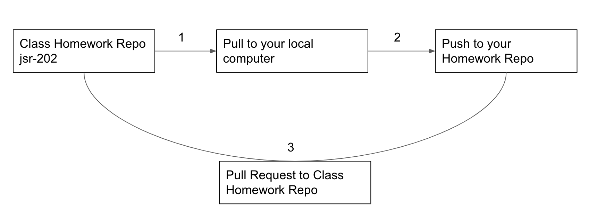

# Homework Repository

| Link | Description |
| --- | --- |
[File Format](#fileformat) | File Format |
[Homework Submission](#homeworksubmission) | Homework Submission Process |
[Due Dates](#duedates) | Due Dates |
[Setup](#setup)| Setup |

<a name="fileformat"></a>
### File Format
Lets remember to name files or folders for homework with a dash followed by your first name and last name initial before submitting a pull request
* File: `assignment-KyleL.js`
* Folder: `/homework2-KyleL`

<a name="homeworksubmission"></a>
### Homework Submission Process

1. First lets always pull down the latest code
```bash
$ git pull upstream master
```

2. Make a copy of the starter code/homework files

So in order for us to have a smooth process of turning in homework and to avoid merge conflicts with other students. When working on homework, try to create a folder with the above naming format before starting.

For example if the file structure of `hw1` looks like:
```
/jsr-202-hw
└── /hw1
    └── /starter-code
        ├── /madlib-with-loops
        ├── array.js
        └── bonus-hw1.js
    └── README.md
```

Lets make a copy of the `/starter-code` folder into a new folder:
```
/jsr-202-hw
├── /hw1
    └── /starter-code
        ├── /madlib-with-loops
        ├── array.js
        └── bonus-hw1.js
    └── /homework1-KyleL
        ├── /madlib-with-loops
        ├── array.js
        └── bonus-hw1.js
    └── README.md
```
So now you should not have to touch any of the files already in the homework repository. Your code should be done in your new folder and NOT in `/starter-code`

3. If the homework assignment is long, feel free to commit multiple times. But once you are complete with your homework and ready to turn in, remember to commit one last time:
```
$ git add -A
$ git commit -m 'change has been made'
$ git push origin master
```

4. Create a pull request on your repository and submit for review!

<a name="duedates"></a>
### Due Dates
| Assigned | Description | Due Date |
| --- | --- | --- |
| 02/04/21 | Homework 0 (Optional) | N/A |
| 02/09/21 | Homework 1 | 02/18/21 |
| 02/11/21 | Homework 2 | 02/16/21 |
| 02/16/21 | Homework 3 | 02/18/21 |

<a name="setup"></a>
### Setup
1. Our submission for homework will be set up in a similar fashion to our class repository setup. Our homework repository will be located [here](https://git.generalassemb.ly/kyleta/jsr-202-hw). Once again we will want to fork this repository, clone it to your local computer, add the upstream, push up to your repository, and a new step will be submit a pull request to turn in your homework.
2. The fork button is located in the top right of the repository page.
3. Click the green drop down button labeled "Code." Copy the link provided.
4. Go over to your terminal and navigate to the folder you would like to place this repository in. Then to clone the repository, type this command with the link replaced as the one you copied from your repository:
```bash
$ git clone https://git.generalassemb.ly/<USERNAME>/jsr-202-hw.git
```
5. Next we want to set the upstream to the class homework repository. We do this so that we pull the lastest homework assignments from class repository.
```bash
$ git remote add upstream https://git.generalassemb.ly/kyleta/jsr-202-hw.git
```
6. When you need to pull down new changes from the class repository, you want to tell git correctly from where so we type in `git pull` with the location of `upstream master`
```bash
$ git pull upstream master
```
7. If the merge is successful, you will get a message with something like: "Please enter a commit message to explain why this merge is necessary, especially if it merges an updated upstream into a topic branch." If you would like, youre welcome to write a message. How to do this, you would do theses steps (this also assumes your default terminal editor is vim):

    1. press "i" (i for insert)
    2. write your merge message
    3. press "esc" (escape)
    4. write ":wq" (write & quit)
    5. then press enter

If no message is needed, go ahead and just type `:qa`. A default message will be created

8. To push up work, we will do the same normal process of git which is add, commit and push
```
$ git add -A
$ git commit -m 'change has been made'
$ git push origin master
```
9. Here is where its a little different. To turn in your homework go to your repository on Github and click on the tab "Pull Request." Select "New Pull Request."
10. If there are differences between the class homework repository and your homework repository, you should see it there and the "Create Pull Request" button should be available.
11. Give it an appropriate title like "(YOUR NAME) Homework" and you are all set


