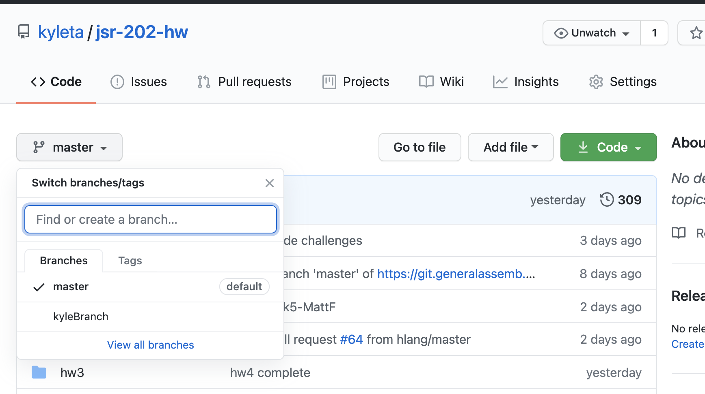

# Git Branches
Feel free to read more from documentation by:

* [Atlassian (Bitbucket)](https://www.atlassian.com/git/tutorials/using-branches#:~:text=Git%20branches%20are%20effectively%20a%20pointer%20to%20a%20snapshot%20of%20your%20changes.&text=Instead%20of%20copying%20files%20from,not%20a%20container%20for%20commits)
* [Git](https://git-scm.com/docs/git-branch)

For this exercise we will practice using git branches and do pull requests with git branches. Lets get started:

1. Lets do a pull to make sure we have the latest code:
```
$ git pull upstream master
```
2. Make sure you are in the correct folder in your terminal, should be the `jsr-202-hw`
3. Create a branch, make sure to name it unique similar to your homework:
```
$ git branch kyleBranch
```
4. Change branches so you are on your newly created branch, you should get a message too:
```
$ git checkout kyleBranch
Switched to branch 'kyleBranch'
```
5. If you do a `git status`, you should see that it will also say what branch you are on:
```
$ git status
On branch kyleBranch
```
6. Lets now push the branch up to GitHub:
```
$ git push origin kyleBranch
```
7. You can now double check on Github and see that branch is available in the left drop down:


8. Lets actually make a change so that we have something to compare, create a file in the `/gitBranch` folder:
```
$ cd gitBranch
$ touch example-KyleL.txt
```

9. Add, commit, and push this change up to GitHub:
```
$ git add -A
$ git commit -m 'added a file'
$ git push origin kyleBranch
```